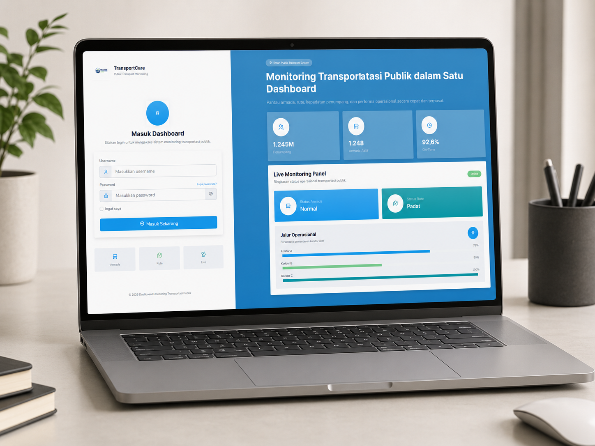

<p align="center">
  
</p>

<h1 align="center">🚍 TransMonitor Dashboard</h1>

<p align="center">
  <b>Smart Public Transport Monitoring System</b><br>
  Built with Laravel to monitor fleet, routes, schedules, and operational performance in real-time.
</p>

<p align="center">
  
  
  
  
</p>

<p align="center">
  <a href="#-about-project">About</a> •
  <a href="#-key-features">Features</a> •
  <a href="#-preview">Preview</a> •
  <a href="#-tech-stack">Tech Stack</a> •
  <a href="#-installation">Installation</a>
</p>

---

# 📌 About Project

**TransMonitor** adalah aplikasi dashboard berbasis web yang dirancang untuk memantau operasional transportasi publik secara terpusat, modern, dan real-time.

Sistem ini membantu pengelola transportasi dalam mengelola armada, rute perjalanan, jadwal, halte, serta performa layanan dalam satu sistem dashboard yang interaktif dan mudah digunakan.

---

# ✨ Value Proposition

- 🚀 Real-time fleet monitoring
- 🗺️ Route & transport management
- ⏱️ Schedule tracking system
- 📊 Data-driven operational insights
- 🔐 Secure authentication & role system
- 📱 Responsive modern UI dashboard

---

# 🚍 Key Features

### 🚌 Fleet Monitoring

- Tracking kendaraan real-time
- Status operasional armada
- Monitoring ketersediaan unit

### 🗺️ Route Management

- Pengelolaan rute transportasi
- Mapping jalur perjalanan
- Struktur jaringan transport

### ⏱️ Schedule System

- Manajemen jadwal keberangkatan
- Tracking ketepatan waktu
- Update schedule otomatis

### 📍 Station & Stop Management

- Data halte & titik pemberhentian
- Informasi lokasi transportasi
- Manajemen titik rute

### 📊 Analytics Dashboard

- Statistik operasional
- Visualisasi performa transportasi
- Insight berbasis data

### 🔐 Authentication System

- Multi-role access (Admin, Operator)
- Secure login system
- Role-based permission

---

# 🖼 Preview

## 📊Login

<p align="center">
  
</p>


## 📊 Dashboard Overview

<p align="center">
  
</p>

## 🗺 Route Monitoring

<p align="center">
  
</p>

## 🚌 Fleet Status

<p align="center">
  
</p>

---

# 🧠 System Architecture

```bash
Client (Browser / Vue / Blade)
        ↓
Laravel Routes
        ↓
Controller Layer
        ↓
Service / Business Logic
        ↓
Eloquent ORM
        ↓
MySQL Database
```
